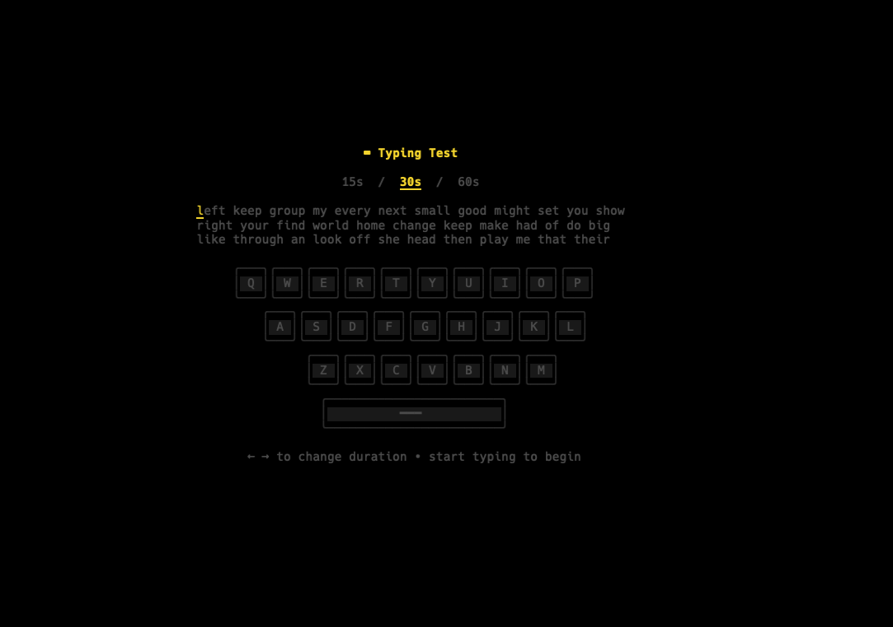

# kbd-cli

A monkeytype-style typing speed test for the terminal, built with [Bubble Tea](https://github.com/charmbracelet/bubbletea) and [Lip Gloss](https://github.com/charmbracelet/lipgloss).



## Features

- Timed typing tests (15s / 30s / 60s)
- Live keyboard visualization with key flash on press
- WPM and accuracy results
- 200 most common English words

## Install

```
go install github.com/kennethliu0/kbd-cli@latest
```

Or build from source:

```
go build
./kbd-cli
```

## Controls

- **← →** change test duration
- **Start typing** to begin the test
- **Tab** to restart after results
- **Ctrl+C** to exit
